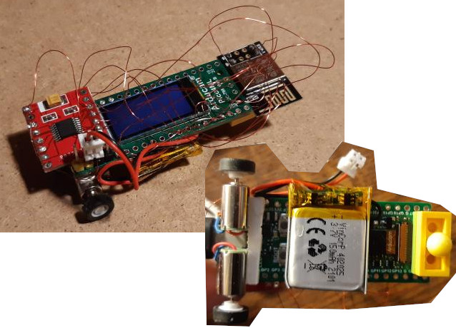

# Pico4MLcbot hm01b0 camera and st7735 display demo 
## Hardware Connection

```
int PIN_LED = 25;
int PIN_CAM_SIOC = 5; // I2C0 SCL
int PIN_CAM_SIOD = 4; // I2C0 SDA
int PIN_CAM_RESETB = 2;
int PIN_CAM_XCLK = 3;
int PIN_CAM_VSYNC = 16;     //GP15 hsync  GP14 pixel clock     
int PIN_CAM_Y2_PIO_BASE = 6;   // data GPIO6

int EPD_RST_PIN     = 7;  // st7735 display
int EPD_DC_PIN      = 9;
int EPD_CS_PIN      = 13;
int EPD_CLK_PIN     = 10;
int EPD_MOSI_PIN    = 11;

int DRV8833_AIN2    = 21; // forw left
int DRV8833_AIN1    = 20; // back left
int DRV8833_BIN1    = 19; // forw right
int DRV8833_BIN2    = 18; // back right

int ESP1_RX         = 0;  // ESP8285 for Wifi
int ESP1_TX         = 1;
```

## Clone repo 
```bash
    git clone https://github.com/Hermann-SW/RPI-Pico-Cam.git
```
## Compile rp2040_hm01b0_st7735 demo
```bash
    cd RPI-Pico-Cam/rp2040_hm01b0_st7735
    mkdir build
    cd build
    cmake ..
    cd build 
    make 
```
## Copy the arducam_firmware.uf2 to pico

## test

